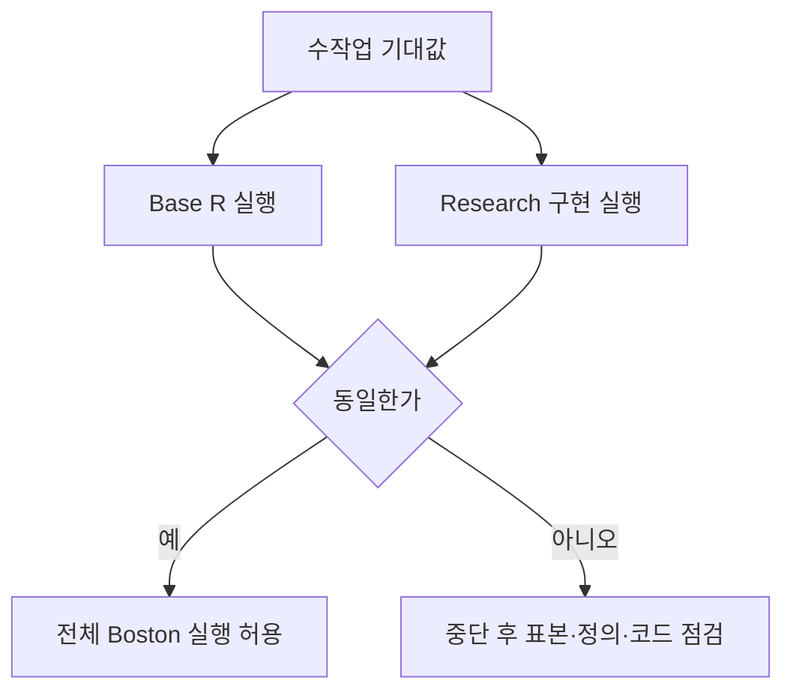
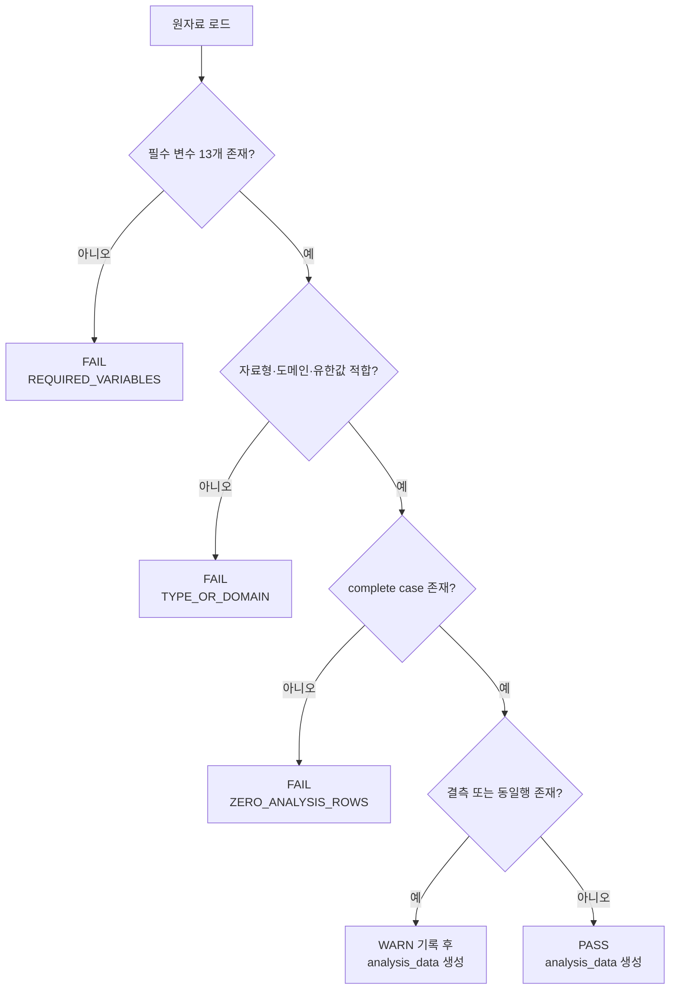
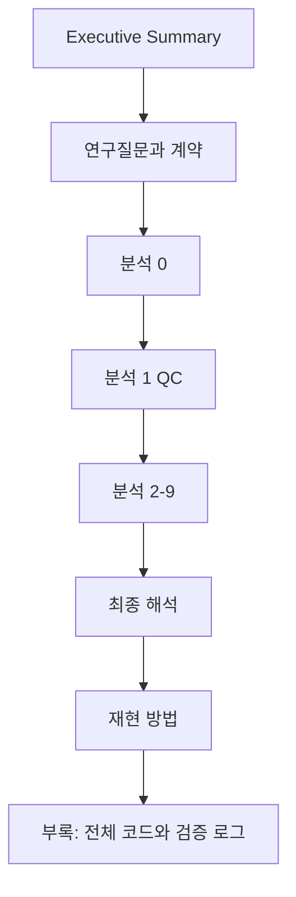

<div class="boston-hero" role="note" aria-label="보고서 핵심 상태">
  <p class="boston-eyebrow">RESEARCH BLUEPRINT · ISLR2::Boston</p>
  <p class="boston-lead">연구 질문을 고정하고, 두 구현을 교차 검증한 뒤, 재현 가능한 게시물까지 만드는 전체 분석 설계입니다.</p>
  <div class="boston-facts">
    <span><strong>506</strong> 관측치</span>
    <span><strong>13</strong> 변수</span>
    <span><strong>12</strong> 설명변수</span>
    <span><strong>NOT RUN</strong> 실행 전 설계</span>
  </div>
</div>

<style>
.boston-hero {
  margin: 0 0 2rem;
  padding: clamp(1.25rem, 3vw, 2rem);
  border: 1px solid rgba(38, 139, 210, .28);
  border-radius: 1rem;
  background:
    radial-gradient(circle at 92% 12%, rgba(42, 161, 152, .18), transparent 34%),
    linear-gradient(145deg, rgba(38, 139, 210, .12), rgba(42, 161, 152, .05));
}
.boston-eyebrow {
  margin: 0 0 .7rem;
  color: var(--link-color);
  font-size: .75rem;
  font-weight: 750;
  letter-spacing: .13em;
}
.boston-lead {
  max-width: 44rem;
  margin: 0;
  font-size: clamp(1.05rem, 2.2vw, 1.35rem);
  font-weight: 650;
  line-height: 1.55;
}
.boston-facts {
  display: grid;
  grid-template-columns: repeat(4, minmax(0, 1fr));
  gap: .65rem;
  margin-top: 1.35rem;
}
.boston-facts span {
  padding: .7rem .8rem;
  border: 1px solid rgba(127, 127, 127, .18);
  border-radius: .7rem;
  background: rgba(255, 255, 255, .42);
  font-size: .82rem;
}
.boston-facts strong { display: block; font-size: 1.05rem; }
@media (max-width: 640px) {
  .boston-facts { grid-template-columns: repeat(2, minmax(0, 1fr)); }
}
@media (prefers-color-scheme: dark) {
  .boston-facts span { background: rgba(15, 23, 42, .3); }
}
</style>

## 집행 요약

이 보고서는 `ISLR2::Boston` 자료를 대상으로, 우리가 확정한 **7(+1) 규칙 연구 파이프라인**에 따라 분석을 설계하고, 그 설계를 그대로 Codex에 전달해 **R 코드 생성 → 원격 실행 → 결과 검증 → 블로그 게시용 산출물 생성**까지 연결할 수 있도록 만든 실행 문서다. 분석 범위는 **연관성 설명**에 한정하며, 인과 해석은 명시적으로 배제한다. `ISLR2::Boston`은 **506행, 13변수**의 주거·환경 자료이며, 본 과제에서는 `crim`을 결과변수로, 나머지 12개 변수를 설명변수로 사용한다. `black` 변수는 이번 `ISLR2::Boston`에는 존재하지 않으므로 분석 계약에서 제외한다. 

실행 구현은 항상 두 갈래로 병렬화한다. **교육용 구현**은 Base R로, **연구 확장형 구현**은 QC에는 `checkmate`, 결과 추출과 그림에는 `broom`과 `ggplot2`를 사용한다. 두 구현은 동일한 데이터, 동일한 complete-case 표본, 동일한 통계 정의, 동일한 출력 스키마를 공유하고, 매 단계마다 **수작업 기대값 = Base R = Research implementation**의 삼중 검증을 통과해야 다음 단계로 넘어간다. 선형회귀는 R의 `stats::lm()`를 공통 엔진으로 사용하며, `confint()`와 `anova()`는 공식 R 통계 도구 체계 안에서 그대로 사용한다. 

현재 이 환경에서는 R을 직접 실행하지 않으므로, **Boston 실제 수치 출력은 `NOT RUN`**으로 남긴다. 대신 Codex가 원격 러너 또는 GitHub Actions/Codespaces에서 R을 실행할 수 있도록 **파일 구조, 스크립트 순서, 테스트 fixture, 동등성 검사, GitHub Pages 배포 절차**를 모두 명시한다. GitHub Pages는 정적 파일 또는 GitHub Actions artifact 배포를 지원하고, 사용자/조직 사이트 저장소는 `<user>.github.io` 이름 규칙을 따른다. Pages의 custom workflow는 `configure-pages`, `upload-pages-artifact`, `deploy-pages` 조합으로 구성할 수 있다. 

## 고정 연구 계약과 공통 원칙

이번 분석은 `ISLR2` 패키지의 Boston 데이터를 이용한다. 공식 문서에 따르면 이 데이터는 Boston 교외 506개 구역의 주택·환경 값을 담고 있고, 변수는 `crim`, `zn`, `indus`, `chas`, `nox`, `rm`, `age`, `dis`, `rad`, `tax`, `ptratio`, `lstat`, `medv`로 구성된다. `chas`는 찰스강 인접 여부의 0/1 더미변수이고, `rad`는 방사형 고속도로 접근성 지수다. 자료는 MASS의 Boston 자료를 약간 수정한 버전을 기반으로 한다. 

공통 분석 계약은 다음과 같다.

| 항목 | 고정값 |
|---|---|
| 데이터 | `ISLR2::Boston` |
| 결과변수 | `crim` |
| 설명변수 | `zn + indus + chas + nox + rm + age + dis + rad + tax + ptratio + lstat + medv` |
| 해석 범위 | association only, non-causal |
| 공통 표본 | 위 13개 변수의 complete case |
| 교육용 구현 | Base R |
| 연구 구현 | QC=`checkmate`, 결과 추출=`broom`, 그림=`ggplot2` |
| 회귀 엔진 | 공통으로 `stats::lm()` |
| exact 구조 비교 | `identical()` 또는 `all.equal(..., tolerance = 1e-12)` |
| 실무 수치 비교 | `all.equal(..., tolerance = 1e-8)` |
| 로컬 R 미설치 환경 | GitHub Actions 또는 Codespaces에서 실행 |
| 본 문서의 실제 Boston 수치 | `NOT RUN` |

이 파이프라인은 다음 순서를 강제한다.


도구 선택은 “패키지를 쓰지 않아도 된다”는 이유가 아니라, **기능 적합성·유지보수·의존성·생태계 채택도**를 함께 비교한 뒤 결정한다. 사용률은 `cranlogs`로 조사하지만, `cranlogs`는 **RStudio/Posit CRAN mirror 로그만 다루므로 전체 CRAN 사용량이 아니라 대리지표**다. 따라서 Codex는 실행 시점에 `cranlogs::cran_downloads()`로 최근 12개월 다운로드를 직접 계산하고, CRAN package page의 reverse dependencies와 published date를 함께 비교해야 한다. 

QC용 상위 후보는 `checkmate`, `assertthat`, `assertr`이며, `validate`와 `pointblank`는 강력하지만 이번 과제 기준으로는 상대적으로 과설계 가능성이 있다. `checkmate`는 빠르고 엄격한 argument check를 제공하고 import가 가볍다. `assertthat`은 `stopifnot()` 대체에 가깝고 마지막 공개 CRAN 갱신이 2019년이다. `assertr`는 분석 파이프라인용으로 친화적이지만 `dplyr`, `MASS`, `rlang` 등을 import한다. `validate`는 field·record·cross-dataset 수준 규칙을 지원하고, `pointblank`는 로컬·원격 테이블 검증과 보고 기능이 강하지만 의존성이 훨씬 무겁다. 

결과 추출용 상위 후보는 `broom`, `parameters`, `modelsummary`다. `broom`은 `tidy()`, `glance()`, `augment()`를 통해 회귀 객체를 tidy tibble로 바꾸는 데 강하고, 회귀 결과 추출과 후속 시각화에 직접적이다. `parameters`는 여러 모형의 계수·신뢰구간·추가지표 산출에 강하지만 의존성과 기능 범위가 넓다. `modelsummary`는 표 생성과 출판용 출력에 강력하지만, 이번 프로젝트의 핵심은 “회귀 결과 추출과 비교”이므로 1차 연구 구현은 `broom`이 가장 맞다. 

시각화 도구는 연구 구현에서 `ggplot2`로 고정한다. 공식 설명 그대로, `ggplot2`는 Grammar of Graphics 기반의 선언적 시각화 시스템이며 현재도 활발히 갱신되고 있다. 교육용 구현은 Base R의 `plot()`, `hist()`, `boxplot()`, `pairs()`를 사용한다. 

아래 표는 Codex가 실행 시 채워야 할 최종 조사 표의 템플릿이다.

| 범주 | 후보 | 최근 12개월 cranlogs 다운로드 | CRAN reverse deps/imports | Published | Imports burden | 1차 판정 |
|---|---|---:|---|---|---|---|
| QC | checkmate | NOT RUN | CRAN page 확인 | 2026-02-03 | 낮음 | 채택 |
| QC | assertthat | NOT RUN | CRAN page 확인 | 2019-03-21 | 매우 낮음 | shortlist |
| QC | assertr | NOT RUN | CRAN page 확인 | 2023-11-23 | 중간 | shortlist |
| QC 예비 | validate | NOT RUN | CRAN page 확인 | 2025-12-10 | 중간 | reserve |
| QC 예비 | pointblank | NOT RUN | CRAN page 확인 | 2025-11-28 | 높음 | reserve |
| 추출 | broom | NOT RUN | CRAN page 확인 | 2026-05-14 | 중간 | 채택 |
| 추출 | parameters | NOT RUN | CRAN page 확인 | 2026-06-28 | 높음 | shortlist |
| 추출 | modelsummary | NOT RUN | CRAN page 확인 | 2026-02-13 | 높음 | shortlist |

이 표의 다운로드 열은 아래 코드를 실행해 채운다.

```r
# file: scripts/90_package_survey.R
install.packages("cranlogs", repos = "https://cloud.r-project.org")

survey_downloads <- function(pkgs, from = Sys.Date() - 365, to = Sys.Date() - 1) {
  x <- cranlogs::cran_downloads(packages = pkgs, from = from, to = to)
  aggregate(count ~ package, data = x, FUN = sum)
}

qc_candidates      <- c("checkmate", "assertthat", "assertr", "validate", "pointblank")
extract_candidates <- c("broom", "parameters", "modelsummary")

qc_downloads      <- survey_downloads(qc_candidates)
extract_downloads <- survey_downloads(extract_candidates)

write.csv(qc_downloads, "results/meta/qc_downloads.csv", row.names = FALSE)
write.csv(extract_downloads, "results/meta/extract_downloads.csv", row.names = FALSE)
```

공통 검증 원칙도 고정한다.



## 분석별 설계

공식 R 문서에 따르면 `lm()`는 선형모형 적합, `confint()`는 모수 신뢰구간, `anova()`는 하나 이상의 `lm` 객체에 대한 분산분석표와 nested model F-test를 제공한다. QC 단계에서 필요한 `complete.cases()`, `is.finite()`, `duplicated()` 역시 각각 complete-case 판정, 유한값 판정, 중복 행 판정 semantics를 제공한다. 진단 단계에서는 `plot.lm()`가 residuals vs fitted, Q-Q, Scale-Location, Cook’s distance, residuals vs leverage 등을, `influence.measures()` 계열이 leave-one-out 영향도 지표를 제공한다. 아래 모든 단계는 이 공식 도구 semantics를 기준으로 설계한다. 

**분석 0 — 연구질문과 계약 고정**

| 7개 단계 | 설계 |
|---|---|
| 질문의 필요성과 현재 단계의 필연성 | 데이터를 보기 전에 결과변수·설명변수·해석범위를 고정해야 한다. 그렇지 않으면 QC 기준과 회귀식이 사후적으로 바뀐다. |
| 필요한 통계적 행위 | 변수 목록 고정, 해석 범위 고정, tolerance 고정, 출력 계약 고정 |
| 필요한 출력 | `contracts/analysis_contract.rds`, `contracts/variable_contracts.csv` |
| 의사결정 규칙 | PASS=`crim`과 12 predictors가 고정됨. FAIL=변수 목록 불일치 또는 인과 해석 문구 포함 |
| 도구 선택 | Base R=리스트·CSV 저장. Research=동일; 패키지 불필요 |
| 검증 방법 | 최소 fixture는 contract 객체 자체. 기대값: response=`"crim"`, predictors 길이=12, all variables 길이=13 |
| 다음 단계 인계 | QC가 검사할 정체성·범위 계약 |

```r
# file: R/00_contracts.R
expected_variables <- c(
  "crim","zn","indus","chas","nox","rm","age",
  "dis","rad","tax","ptratio","lstat","medv"
)

analysis_contract <- list(
  dataset = "ISLR2::Boston",
  response = "crim",
  predictors = setdiff(expected_variables, "crim"),
  binary_predictors = "chas",
  tol_exact = 1e-12,
  tol_numeric = 1e-8,
  interpretation = "association_only"
)

saveRDS(analysis_contract, "contracts/analysis_contract.rds")
write.csv(
  data.frame(variable = expected_variables, stringsAsFactors = FALSE),
  "contracts/expected_variables.csv",
  row.names = FALSE
)
```

**분석 1 — 데이터 QC와 공통 분석 표본 동결**

Boston 변수의 의미를 공식 문서에서 직접 받아 QC 계약으로 바꾼다. `zn`, `indus`, `age`, `lstat`는 비율·percent 변수이므로 0–100 범위를 기본 허용으로 두고, `chas`는 0/1, `rad`는 양의 정수형 지수, `crim`, `nox`, `dis`, `tax`, `medv`는 음수가 될 수 없으며, `rm`, `ptratio`는 0보다 커야 한다. 

| 변수 | 의미형 | QC 허용 범위 |
|---|---|---|
| crim | continuous ratio | finite, `>= 0` |
| zn | percent | `0 <= zn <= 100` |
| indus | percent-like proportion | `0 <= indus <= 100` |
| chas | binary | `{0,1}` |
| nox | concentration | finite, `>= 0` |
| rm | positive continuous | finite, `> 0` |
| age | percent | `0 <= age <= 100` |
| dis | distance | finite, `>= 0` |
| rad | discrete index | positive integer-ish |
| tax | nonnegative rate | finite, `>= 0` |
| ptratio | positive ratio | finite, `> 0` |
| lstat | percent | `0 <= lstat <= 100` |
| medv | nonnegative value | finite, `>= 0` |

QC 의사결정은 다음 흐름을 따른다.



정상/WARN/FAIL 최소 fixture와 수작업 기대값은 아래와 같이 고정한다.

| fixture | 핵심 변경 | 기대 결과 |
|---|---|---|
| normal_qc | 3행, 모든 변수 정상 | rows=3, complete_rows=3, excluded=0, status=PASS |
| warn_missing_qc | `medv[2] <- NA` | rows=3, complete_rows=2, excluded=1, status=WARN |
| fail_chas_qc | `chas[1] <- 2` | `CHAS_DOMAIN=FAIL`, 분석 중단 |
| fail_age_qc | `age[1] <- 101` | `AGE_RANGE=FAIL`, 분석 중단 |
| fail_crim_qc | `crim[1] <- -1` | `CRIM_RANGE=FAIL`, 분석 중단 |
| fail_rad_qc | `rad[1] <- 2.5` | `RAD_INTEGERISH=FAIL`, 분석 중단 |

```r
# file: R/fixtures_qc.R
normal_qc <- data.frame(
  crim = c(1,2,3),
  zn = c(10,20,30),
  indus = c(5,6,7),
  chas = c(0,1,0),
  nox = c(0.4,0.5,0.6),
  rm = c(5,6,7),
  age = c(40,50,60),
  dis = c(1,2,3),
  rad = c(1,2,3),
  tax = c(100,200,300),
  ptratio = c(10,11,12),
  lstat = c(5,10,15),
  medv = c(20,21,22)
)

warn_missing_qc <- normal_qc; warn_missing_qc$medv[2] <- NA
fail_chas_qc <- normal_qc; fail_chas_qc$chas[1] <- 2
fail_age_qc  <- normal_qc; fail_age_qc$age[1]  <- 101
fail_crim_qc <- normal_qc; fail_crim_qc$crim[1] <- -1
fail_rad_qc  <- normal_qc; fail_rad_qc$rad[1] <- 2.5
```

Base R 구현 템플릿은 직접 규칙을 평가하고, `checkmate` 구현은 assertion과 adapter를 통해 동일 스키마를 반환한다. 두 구현의 **결과표 열 이름과 의미는 반드시 동일**해야 한다.

```r
# file: R/01_qc.R
new_qc_row <- function(check_id, check_name, status, observed, expected, detail = "") {
  data.frame(
    check_id = check_id,
    check_name = check_name,
    status = status,
    observed = as.character(observed),
    expected = as.character(expected),
    detail = as.character(detail),
    stringsAsFactors = FALSE
  )
}

run_qc_base <- function(data, contract) {
  out <- list()
  vars_ok <- identical(names(data), contract$expected_variables) ||
    setequal(names(data), contract$expected_variables)
  out[[length(out) + 1]] <- new_qc_row(
    "REQUIRED_VARIABLES", "필수 변수 존재",
    if (vars_ok) "PASS" else "FAIL",
    paste(names(data), collapse = ","),
    paste(contract$expected_variables, collapse = ",")
  )
  if (!vars_ok) return(list(qc = do.call(rbind, out), analysis_data = NULL))

  finite_ok <- all(vapply(data[setdiff(contract$expected_variables, "chas")], function(x) {
    all(is.finite(x) | is.na(x))
  }, logical(1)))
  out[[length(out) + 1]] <- new_qc_row(
    "FINITE_VALUES", "유한값 검사",
    if (finite_ok) "PASS" else "FAIL",
    finite_ok, TRUE
  )
  if (!finite_ok) return(list(qc = do.call(rbind, out), analysis_data = NULL))

  chas_ok <- all(data$chas %in% c(0, 1))
  out[[length(out) + 1]] <- new_qc_row(
    "CHAS_DOMAIN", "chas는 0/1",
    if (chas_ok) "PASS" else "FAIL",
    paste(sort(unique(data$chas)), collapse = ","),
    "0,1"
  )
  if (!chas_ok) return(list(qc = do.call(rbind, out), analysis_data = NULL))

  cc <- complete.cases(data[contract$expected_variables])
  n0 <- nrow(data)
  n1 <- sum(cc)
  out[[length(out) + 1]] <- new_qc_row(
    "COMPLETE_CASES", "공통 complete case",
    if (n1 < n0) "WARN" else "PASS",
    n1, n0
  )
  if (n1 == 0) {
    out[[length(out) + 1]] <- new_qc_row("ZERO_ANALYSIS_ROWS", "분석 표본 0", "FAIL", 0, ">0")
    return(list(qc = do.call(rbind, out), analysis_data = NULL))
  }

  dup_n <- sum(duplicated(data))
  out[[length(out) + 1]] <- new_qc_row(
    "DUPLICATED_ROWS", "완전 동일 행 수",
    if (dup_n > 0) "WARN" else "PASS",
    dup_n, 0
  )

  analysis_data <- data[cc, contract$expected_variables, drop = FALSE]
  list(
    qc = do.call(rbind, out),
    analysis_data = analysis_data,
    complete_rows = which(cc)
  )
}

run_qc_research <- function(data, contract) {
  qc <- list()
  checkmate::assert_data_frame(data, min.rows = 1L, min.cols = length(contract$expected_variables))
  qc[[length(qc) + 1]] <- new_qc_row("DATA_FRAME", "입력은 data.frame", "PASS", TRUE, TRUE)

  has_all <- setequal(names(data), contract$expected_variables)
  qc[[length(qc) + 1]] <- new_qc_row(
    "REQUIRED_VARIABLES", "필수 변수 존재",
    if (has_all) "PASS" else "FAIL",
    paste(names(data), collapse = ","),
    paste(contract$expected_variables, collapse = ",")
  )
  if (!has_all) return(list(qc = do.call(rbind, qc), analysis_data = NULL))

  checkmate::assert_numeric(data$crim, any.missing = TRUE, lower = 0)
  chas_ok <- all(data$chas %in% c(0,1))
  qc[[length(qc) + 1]] <- new_qc_row("CHAS_DOMAIN", "chas는 0/1", if (chas_ok) "PASS" else "FAIL",
                                     paste(sort(unique(data$chas)), collapse=","), "0,1")
  if (!chas_ok) return(list(qc = do.call(rbind, qc), analysis_data = NULL))

  cc <- complete.cases(data[contract$expected_variables])
  analysis_data <- data[cc, contract$expected_variables, drop = FALSE]
  qc[[length(qc) + 1]] <- new_qc_row(
    "COMPLETE_CASES", "공통 complete case",
    if (sum(cc) < nrow(data)) "WARN" else "PASS",
    sum(cc), nrow(data)
  )

  list(
    qc = do.call(rbind, qc),
    analysis_data = analysis_data,
    complete_rows = which(cc)
  )
}

compare_qc_results <- function(base_res, research_res) {
  stopifnot(identical(base_res$complete_rows, research_res$complete_rows))
  stopifnot(identical(base_res$analysis_data, research_res$analysis_data))
}

# production entrypoint
contract <- readRDS("contracts/analysis_contract.rds")
contract$expected_variables <- expected_variables

boston_raw <- ISLR2::Boston
saveRDS(boston_raw, "data/raw/Boston.rds")

base_qc     <- run_qc_base(boston_raw, contract)
research_qc <- run_qc_research(boston_raw, contract)
compare_qc_results(base_qc, research_qc)

write.table(base_qc$qc, "results/01_qc/qc_base.tsv", sep = "\t", row.names = FALSE, quote = FALSE)
write.table(research_qc$qc, "results/01_qc/qc_research.tsv", sep = "\t", row.names = FALSE, quote = FALSE)
saveRDS(base_qc$analysis_data, "data/processed/analysis_data.rds")
```

Negative test는 꼭 개별 고장 모드별로 분리한다.

```r
# file: tests/test_qc_negative.R
stopifnot(run_qc_base(normal_qc, contract)$qc$status[1] == "PASS")
stopifnot(any(run_qc_base(warn_missing_qc, contract)$qc$status == "WARN"))
stopifnot(any(run_qc_base(fail_chas_qc, contract)$qc$check_id == "CHAS_DOMAIN"))
stopifnot(any(run_qc_base(fail_age_qc,  contract)$qc$check_id == "AGE_RANGE"))
stopifnot(any(run_qc_base(fail_crim_qc, contract)$qc$check_id == "CRIM_RANGE"))
```

분석 1의 인계 산출물은 `analysis_data.rds`, `qc_base.tsv`, `qc_research.tsv`, `qc_equivalence.tsv`, `sample_flow.tsv`다.

**분석 2 — 기술통계와 분포**

| 7개 단계 | 설계 |
|---|---|
| 질문의 필요성과 현재 단계의 필연성 | QC 이후 표본이 고정되었으므로 이제 변수 스케일, 치우침, 범위, 이산성, `chas` 불균형을 확인해야 한다. 이 단계를 건너뛰면 이후 회귀계수의 단위 해석과 이상값 해석이 빈약해진다. |
| 필요한 통계적 행위 | 각 연속형 변수에 대해 `n`, 결측 후 n, mean, sd, median, q1, q3, min, max. `chas`는 빈도와 비율. 히스토그램·박스플롯·bar plot 생성 |
| 필요한 출력 | `continuous_summary.tsv`, `binary_summary.tsv`, `hist_*.png`, `box_*.png`, `bar_chas.png` |
| 의사결정 규칙 | PASS=모든 요약표·그림 생성. WARN=극단 치우침·이상값 다수. FAIL=표본 수 불일치 또는 파일 누락 |
| 도구 선택 | Base R=`summary`, `sd`, `quantile`, `hist`, `boxplot`, `barplot`. Research=`ggplot2`로 그림, 수치 요약은 Base helper 재사용 |
| 검증 방법 | fixture `x = 1:5` 기대값: n=5, mean=3, median=3, sd=`sqrt(2.5)=1.5811388301`, q1=2, q3=4, min=1, max=5 |
| 다음 단계 인계 | 변수별 기본 스케일·분포 정보, 시각화 아티팩트 |

```r
# file: R/02_descriptive.R
summarise_continuous_base <- function(x) {
  c(
    n = sum(!is.na(x)),
    mean = mean(x, na.rm = TRUE),
    sd = sd(x, na.rm = TRUE),
    median = median(x, na.rm = TRUE),
    q1 = unname(quantile(x, 0.25, na.rm = TRUE, type = 7)),
    q3 = unname(quantile(x, 0.75, na.rm = TRUE, type = 7)),
    min = min(x, na.rm = TRUE),
    max = max(x, na.rm = TRUE)
  )
}

make_hist_base <- function(x, name, out) {
  png(out, width = 900, height = 600)
  hist(x, main = paste("Histogram:", name), xlab = name)
  dev.off()
}

make_hist_research <- function(df, var, out) {
  p <- ggplot2::ggplot(df, ggplot2::aes(x = .data[[var]])) +
    ggplot2::geom_histogram(bins = 30) +
    ggplot2::labs(title = paste("Histogram:", var), x = var, y = "Count")
  ggplot2::ggsave(out, p, width = 8, height = 5)
}
```

**분석 3 — 결과변수와 각 설명변수의 관계 탐색**

| 7개 단계 | 설계 |
|---|---|
| 질문의 필요성과 현재 단계의 필연성 | 분포만으로는 `crim`과 각 predictor의 방향성·이상 관측치·선형성 초기 힌트를 알 수 없다. 단순회귀 전에 시각적 관계를 먼저 봐야 회귀 결과가 “뜻밖의 수치”가 아니라 “예상된 패턴의 정량화”가 된다. |
| 필요한 통계적 행위 | 연속형 predictor 11개에 대해 `crim` 산점도 + OLS 선, `chas`에 대해 group boxplot 또는 violin/boxplot |
| 필요한 출력 | `scatter_<x>.png`, `box_chas_crim.png`, 보조표 `line_fit_preview.tsv` |
| 의사결정 규칙 | PASS=12개 관계 그림 생성. WARN=강한 비선형성·극단점. FAIL=표본 불일치 또는 파일 누락 |
| 도구 선택 | Base R=`plot`, `abline`, `boxplot`. Research=`ggplot2::geom_point()`, `geom_smooth(method="lm")`, `geom_boxplot()` |
| 검증 방법 | fixture `x=(1,2,3)`, `y=(2,4,6)` 기대 직선: intercept=0, slope=2 |
| 다음 단계 인계 | 각 predictor에 대한 회귀식 방향·선형성 초안 |

```r
# file: R/03_relationships.R
preview_line_base <- function(x, y) {
  mod <- stats::lm(y ~ x)
  coef(mod)
}

plot_relation_base <- function(df, xvar, out) {
  png(out, width = 900, height = 600)
  plot(df[[xvar]], df$crim, xlab = xvar, ylab = "crim", main = paste("crim vs", xvar))
  abline(stats::lm(df$crim ~ df[[xvar]]), lwd = 2)
  dev.off()
}

plot_relation_research <- function(df, xvar, out) {
  p <- ggplot2::ggplot(df, ggplot2::aes(x = .data[[xvar]], y = crim)) +
    ggplot2::geom_point() +
    ggplot2::geom_smooth(method = "lm", se = FALSE) +
    ggplot2::labs(title = paste("crim vs", xvar), x = xvar, y = "crim")
  ggplot2::ggsave(out, p, width = 8, height = 5)
}
```

**분석 4 — 12개 단순회귀**

| 7개 단계 | 설계 |
|---|---|
| 질문의 필요성과 현재 단계의 필연성 | 시각 탐색 다음에는 각 predictor를 하나씩 넣었을 때 `crim`과의 단순 연관 강도·방향·불확실성을 정량화해야 한다. 다중회귀 전에 해야 하는 이유는 조정 전 관계를 기준선으로 남겨야 하기 때문이다. |
| 필요한 통계적 행위 | 각 predictor `x`에 대해 `lm(crim ~ x)` 적합, 회귀계수·표준오차·t·p·95% CI·R² 저장 |
| 필요한 출력 | `simple_models_base.tsv`, `simple_models_research.tsv`, `simple_models_equivalence.tsv` |
| 의사결정 규칙 | PASS=12모형 모두 성공·두 구현一致. WARN=계수 방향과 시각 탐색 불일치. FAIL=상수 predictor, sample mismatch, extraction mismatch |
| 도구 선택 | Base R=`lm`, `summary`, `confint`. Research=`lm` + `broom::tidy(conf.int=TRUE)` + `broom::glance()` |
| 검증 방법 | fixture `x=(0,1,2,3)`, `y=(1,3,5,7)` 기대값: intercept=1, slope=2, R²=1 |
| 다음 단계 인계 | 12개 unadjusted effect 표 |

```r
# file: R/04_simple_regression.R
fit_simple_base <- function(data, predictor) {
  f <- stats::as.formula(sprintf("crim ~ %s", predictor))
  mod <- stats::lm(f, data = data)
  sm  <- summary(mod)
  ci  <- stats::confint(mod)
  data.frame(
    predictor = predictor,
    term = rownames(sm$coefficients),
    estimate = sm$coefficients[, "Estimate"],
    std_error = sm$coefficients[, "Std. Error"],
    statistic = sm$coefficients[, "t value"],
    p_value = sm$coefficients[, "Pr(>|t|)"],
    conf_low = ci[,1],
    conf_high = ci[,2],
    r_squared = unname(sm$r.squared),
    stringsAsFactors = FALSE
  )
}

fit_simple_research <- function(data, predictor) {
  f <- stats::as.formula(sprintf("crim ~ %s", predictor))
  mod <- stats::lm(f, data = data)
  td  <- as.data.frame(broom::tidy(mod, conf.int = TRUE))
  gl  <- as.data.frame(broom::glance(mod))
  td$predictor <- predictor
  td$r_squared <- gl$r.squared[1]
  td
}
```

**분석 5 — 설명변수 간 중첩 구조**

| 7개 단계 | 설계 |
|---|---|
| 질문의 필요성과 현재 단계의 필연성 | 단순회귀는 각 predictor만 별도로 본 결과다. 다중회귀 전에 설명변수끼리 얼마나 겹치는지 알아야 단순계수와 조정계수 차이의 원인을 해석할 수 있다. |
| 필요한 통계적 행위 | 12 predictors의 pairwise correlation matrix, absolute correlation ranking, pairs plot 또는 heatmap |
| 필요한 출력 | `predictor_correlations.tsv`, `predictor_corr_heatmap.png`, `high_corr_pairs.tsv` |
| 의사결정 규칙 | PASS=대칭 correlation matrix 생성. WARN=절대상관이 큰 쌍 다수. FAIL=차원 불일치 또는 비대칭 |
| 도구 선택 | Base R=`cor`, `pairs`, `image`/`heatmap`. Research=`ggplot2` 타일 heatmap |
| 검증 방법 | fixture `x1=(1,2,3)`, `x2=(2,4,6)` 기대값: `cor(x1,x2)=1` |
| 다음 단계 인계 | 공선성 위험 후보 목록 |

```r
# file: R/05_overlap.R
corr_base <- function(data, predictors) {
  stats::cor(data[predictors], use = "complete.obs", method = "pearson")
}

corr_long <- function(mat) {
  ij <- which(upper.tri(mat), arr.ind = TRUE)
  data.frame(
    var1 = rownames(mat)[ij[,1]],
    var2 = colnames(mat)[ij[,2]],
    corr = mat[ij],
    abs_corr = abs(mat[ij]),
    stringsAsFactors = FALSE
  )
}
```

**분석 6 — 12개 설명변수를 동시에 넣은 다중회귀**

| 7개 단계 | 설계 |
|---|---|
| 질문의 필요성과 현재 단계의 필연성 | 이제 unadjusted 관계가 아니라, 다른 변수들을 동시에 통제했을 때 각 predictor의 부분 연관을 본다. 분석 5 뒤에 배치해야 공선성 맥락 속에서 해석할 수 있다. |
| 필요한 통계적 행위 | `lm(crim ~ zn + indus + chas + nox + rm + age + dis + rad + tax + ptratio + lstat + medv)` 적합, 계수·CI·표준오차·t·p·R²·Adj R²·sigma 추출 |
| 필요한 출력 | `multiple_model_base.tsv`, `multiple_model_research.tsv`, `multiple_glance.tsv` |
| 의사결정 규칙 | PASS=모형 적합·rank full. WARN=강한 공선성 징후 또는 계수 불안정. FAIL=rank deficiency 또는 두 구현 불일치 |
| 도구 선택 | Base R=`lm`, `summary`, `confint`. Research=`lm` + `broom::tidy/glance/augment` |
| 검증 방법 | fixture `x1=(0,1,0,1)`, `x2=(0,0,1,1)`, `y=(1,3,4,6)` 기대값: intercept=1, beta1=2, beta2=3, R²=1 |
| 다음 단계 인계 | 조정된 coefficient 표와 fitted/residual 벡터 |

```r
# file: R/06_multiple_regression.R
multiple_formula <- crim ~ zn + indus + chas + nox + rm + age + dis +
  rad + tax + ptratio + lstat + medv

fit_multiple_base <- function(data) {
  mod <- stats::lm(multiple_formula, data = data)
  sm  <- summary(mod)
  ci  <- stats::confint(mod)
  list(
    coef_table = data.frame(
      term = rownames(sm$coefficients),
      estimate = sm$coefficients[, "Estimate"],
      std_error = sm$coefficients[, "Std. Error"],
      statistic = sm$coefficients[, "t value"],
      p_value = sm$coefficients[, "Pr(>|t|)"],
      conf_low = ci[,1],
      conf_high = ci[,2],
      stringsAsFactors = FALSE
    ),
    glance = data.frame(
      r_squared = sm$r.squared,
      adj_r_squared = sm$adj.r.squared,
      sigma = sm$sigma,
      df_residual = sm$df[2]
    ),
    model = mod
  )
}

fit_multiple_research <- function(data) {
  mod <- stats::lm(multiple_formula, data = data)
  list(
    coef_table = as.data.frame(broom::tidy(mod, conf.int = TRUE)),
    glance = as.data.frame(broom::glance(mod)),
    augment = as.data.frame(broom::augment(mod)),
    model = mod
  )
}
```

**분석 7 — 단순회귀와 다중회귀 계수 비교**

| 7개 단계 | 설계 |
|---|---|
| 질문의 필요성과 현재 단계의 필연성 | 단순회귀 표와 다중회귀 표를 따로 보는 것만으로는 “무엇이 얼마나 바뀌었는가”가 한눈에 안 들어온다. 직전 두 단계의 결과를 합쳐 조정 전후 변화를 비교해야 한다. |
| 필요한 통계적 행위 | predictor별로 unadjusted beta와 adjusted beta, 방향 변화, 크기 변화율, 신뢰구간 병렬 정리 |
| 필요한 출력 | `coef_compare.tsv`, `coef_compare_plot.png` |
| 의사결정 규칙 | PASS=12 predictors 비교표 완성. WARN=부호 반전 또는 큰 크기 변화. FAIL=join 실패 또는 predictor 누락 |
| 도구 선택 | Base R=`merge`, `barplot`/`segments`. Research=`ggplot2` coefficient comparison plot |
| 검증 방법 | fixture `x1=(0,1,1,2,2)`, `x2=(0,1,2,2,3)`, `y=1+2*x1+3*x2`; 기대값: x1 unadjusted slope=`5.6428571`, adjusted slope=`2` |
| 다음 단계 인계 | 조정 전후 차이가 큰 변수 목록 |

```r
# file: R/07_compare_coefficients.R
compare_coefs <- function(simple_tbl, multiple_tbl) {
  s1 <- subset(simple_tbl, term != "(Intercept)", c("predictor", "estimate", "conf_low", "conf_high"))
  names(s1)[2:4] <- c("simple_estimate", "simple_low", "simple_high")

  m1 <- subset(multiple_tbl, term != "(Intercept)", c("term", "estimate", "conf.low", "conf.high"))
  names(m1) <- c("predictor", "multiple_estimate", "multiple_low", "multiple_high")

  out <- merge(s1, m1, by = "predictor", all = TRUE)
  out$sign_change <- sign(out$simple_estimate) != sign(out$multiple_estimate)
  out$abs_change <- abs(out$multiple_estimate - out$simple_estimate)
  out
}
```

**분석 8 — 비선형성 점검**

| 7개 단계 | 설계 |
|---|---|
| 질문의 필요성과 현재 단계의 필연성 | 시각 탐색과 단순회귀만으로는 선형항이 충분한지 확정할 수 없다. 다중회귀 해석을 끝낸 뒤, 각 연속형 predictor에 대해 선형 대 3차 다항을 비교해 비선형성을 별도로 점검한다. |
| 필요한 통계적 행위 | 각 연속 predictor `x`에 대해 `lm(crim ~ x)` 와 `lm(crim ~ x + x^2 + x^3)`를 같은 표본으로 적합하고 nested F-test 수행. `chas`는 제외 |
| 필요한 출력 | `nonlinearity_tests.tsv`, `poly_curve_<x>.png` |
| 의사결정 규칙 | PASS=모든 연속 predictor 테스트 완료. WARN=비선형 evidence 존재. FAIL=비교 모형 표본 불일치 또는 잘못된 nested comparison |
| 도구 선택 | Base R=`lm`, `anova`, `predict`. Research=`lm` + `ggplot2` for fitted curves |
| 검증 방법 | fixture `x=(-2,-1,0,1,2)`, `y=1+x+x^2`; 기대값: cubic raw fit 계수 `(1,1,1,0)`, linear fit은 불완전 |
| 다음 단계 인계 | 선형으로는 부족한 predictor 후보 |

```r
# file: R/08_nonlinearity.R
fit_nonlinear_pair <- function(data, predictor) {
  f_lin  <- stats::as.formula(sprintf("crim ~ %s", predictor))
  f_poly <- stats::as.formula(sprintf("crim ~ %s + I(%s^2) + I(%s^3)", predictor, predictor, predictor))
  m_lin  <- stats::lm(f_lin, data = data)
  m_poly <- stats::lm(f_poly, data = data)
  cmp    <- stats::anova(m_lin, m_poly)
  list(
    linear = m_lin,
    poly = m_poly,
    comparison = cmp
  )
}
```

`anova.lm`는 하나 이상의 선형모형에 대한 ANOVA 표를 계산하고, 여러 객체를 넣으면 nested model에서 자유도와 sum of squares 변화, 그리고 F test를 계산한다. 단, **동일한 데이터셋에 적합된 모형이어야 한다**는 점을 문서가 명시하므로, 분석 1에서 동결한 `analysis_data.rds`를 그대로 재사용해야 한다. 

**분석 9 — 잔차, 영향도, 공선성 진단**

| 7개 단계 | 설계 |
|---|---|
| 질문의 필요성과 현재 단계의 필연성 | 최종 다중회귀를 해석하기 전에 residual pattern, influential point, leverage, collinearity를 확인해야 한다. 이 단계가 마지막이어야 앞선 계수 해석을 진단 결과와 연결해 수정 없이 정리할 수 있다. |
| 필요한 통계적 행위 | `plot.lm(which = c(1,2,3,4,5))`, `hatvalues`, `cooks.distance`, `rstudent`, custom VIF 계산 |
| 필요한 출력 | `diag_resid_fitted.png`, `diag_qq.png`, `diag_scale_location.png`, `diag_cook.png`, `diag_leverage.png`, `influence_table.tsv`, `vif_table.tsv` |
| 의사결정 규칙 | PASS=진단표·그림 완성. WARN=고레버리지·영향점·큰 VIF. FAIL=파일 누락 또는 구현 불일치 |
| 도구 선택 | Base R=`plot.lm`, `hatvalues`, `cooks.distance`, `rstudent`. Research=`broom::augment` + `ggplot2`로 동일 정보 재시각화 |
| 검증 방법 | fixture `x=(1,2,3,10)` simple model with intercept; 기대 leverage=`(0.43, 0.33, 0.27, 0.97)`, 최대는 4번 행 |
| 다음 단계 인계 | 최종 해석 주의점, 영향 관측치 표 |

```r
# file: R/09_diagnostics.R
compute_vif_base <- function(data, predictors) {
  out <- lapply(predictors, function(p) {
    others <- setdiff(predictors, p)
    f <- stats::as.formula(paste(p, "~", paste(others, collapse = " + ")))
    mod <- stats::lm(f, data = data)
    r2 <- summary(mod)$r.squared
    data.frame(term = p, vif = 1 / (1 - r2), stringsAsFactors = FALSE)
  })
  do.call(rbind, out)
}

diagnostics_base <- function(mod) {
  data.frame(
    row = seq_along(stats::hatvalues(mod)),
    hat = stats::hatvalues(mod),
    cooks_d = stats::cooks.distance(mod),
    rstudent = stats::rstudent(mod)
  )
}

diagnostics_research <- function(mod) {
  aug <- as.data.frame(broom::augment(mod))
  infl <- data.frame(
    row = seq_len(nrow(aug)),
    hat = stats::hatvalues(mod),
    cooks_d = stats::cooks.distance(mod),
    rstudent = stats::rstudent(mod)
  )
  merge(aug, infl, by = "row")
}
```

`plot.lm`는 residuals vs fitted, Q-Q, Scale-Location, Cook’s distance, Residuals vs Leverage 등 여섯 종류 진단 그래프를 제공하고, 표준화 잔차와 leverage를 이용한다. `influence.measures()` 계열 함수는 leave-one-out deletion diagnostics를 계산한다. 

**최종 보고 — 블로그·발표 산출 정리**

| 7개 단계 | 설계 |
|---|---|
| 질문의 필요성과 현재 단계의 필연성 | 모든 개별 분석 산출물을 블로그와 발표 흐름으로 조립해야 재현 가능성과 전달력을 동시에 확보한다. 이 단계를 앞당기면 실제 검증이 끝나기 전에 서사가 고정된다. |
| 필요한 통계적 행위 | 산출물 집계, 핵심표·핵심그림 선택, 구현 비교 결과 요약, NOT RUN 잔여 여부 검사 |
| 필요한 출력 | `dist/boston-islr2/index.html`, `dist/assets/*`, `slides/boston_10min.md`, `slides/boston_15min.md`, `slides/boston_20min.md` |
| 의사결정 규칙 | PASS=필수 artifact 존재·링크 유효·NOT RUN 없음(실행 빌드). WARN=`NOT RUN` 남아 있는 dry-run 초안. FAIL=입력 파일 누락 또는 equivalence 실패에도 게시 시도 |
| 도구 선택 | Base R/R Markdown 또는 Quarto 렌더. Research=`broom/ggplot2` 산출물 포함 |
| 검증 방법 | mock dist 디렉터리에서 필수 파일 existence check. 기대값: 모든 지정 경로 존재 |
| 다음 단계 인계 | GitHub Pages artifact 또는 기존 블로그 소스에 삽입할 최종 HTML/이미지 |

## Codex 실행 계획과 게시 자동화

이 문서는 Codex가 바로 실행할 수 있도록 **탐지 → 실행 → 검증 → 렌더 → 배포** 순서를 강제한다. GitHub Pages는 정적 파일을 게시할 수 있으며, custom workflow를 사용할 경우 artifact의 top level에 `index.html` 같은 entry file이 있어야 한다. branch publishing 대신 custom workflow를 쓰면 `actions/configure-pages`, `actions/upload-pages-artifact`, `actions/deploy-pages`로 빌드와 배포를 나눌 수 있다. 

권장 파일 구조는 아래와 같다.

```text
.
├── contracts/
│   ├── analysis_contract.rds
│   └── expected_variables.csv
├── data/
│   ├── raw/
│   │   └── Boston.rds
│   └── processed/
│       └── analysis_data.rds
├── R/
│   ├── 00_contracts.R
│   ├── 01_qc.R
│   ├── 02_descriptive.R
│   ├── 03_relationships.R
│   ├── 04_simple_regression.R
│   ├── 05_overlap.R
│   ├── 06_multiple_regression.R
│   ├── 07_compare_coefficients.R
│   ├── 08_nonlinearity.R
│   ├── 09_diagnostics.R
│   ├── 10_render_site.R
│   ├── fixtures_qc.R
│   └── utils_*.R
├── results/
│   ├── 01_qc/
│   ├── 02_descriptive/
│   ├── 03_relationships/
│   ├── 04_simple_regression/
│   ├── 05_overlap/
│   ├── 06_multiple_regression/
│   ├── 07_compare/
│   ├── 08_nonlinearity/
│   ├── 09_diagnostics/
│   └── meta/
├── site/
│   ├── boston-islr2.Rmd
│   └── templates/
├── dist/
│   └── [rendered html/site artifact]
├── scripts/
│   └── run_all.R
└── .github/
    └── workflows/
        └── publish-boston.yml
```

Codex가 R이 있는 원격 러너에서 수행할 명령은 다음과 같이 고정한다.

```bash
# setup
Rscript -e "install.packages(c('ISLR2','checkmate','broom','ggplot2','cranlogs','rmarkdown'), repos='https://cloud.r-project.org')"

# run
Rscript scripts/run_all.R
```

```r
# file: scripts/run_all.R
dir.create("results", showWarnings = FALSE, recursive = TRUE)
source("R/00_contracts.R")
source("R/01_qc.R")
source("R/02_descriptive.R")
source("R/03_relationships.R")
source("R/04_simple_regression.R")
source("R/05_overlap.R")
source("R/06_multiple_regression.R")
source("R/07_compare_coefficients.R")
source("R/08_nonlinearity.R")
source("R/09_diagnostics.R")
source("R/10_render_site.R")
```

`R/10_render_site.R`는 site source를 existing blog structure에 맞게 렌더한다. 저장소 구조를 아직 모르는 상태를 고려해, Codex는 먼저 repository를 검사해야 한다. GitHub Pages 문서상 사용자 사이트 저장소는 `<user>.github.io` 이름 규칙을 사용하고, entry file은 top level에 있어야 한다. 따라서 Codex의 기본 전략은 다음 우선순위를 따른다. 첫째, 저장소에 이미 Jekyll/Quarto/R Markdown 기반 블로그 구조가 있으면 그 파이프라인에 새로운 글을 삽입한다. 둘째, 구조를 식별할 수 없으면 `dist/boston-islr2/index.html`을 생성하고, 배포 artifact에는 기존 정적 산출물을 보존한 뒤 새 경로만 추가한다. 셋째, 완전한 standalone 배포만 가능한 경우 top-level `index.html`에서 Boston 포스트로 링크한다. 

자동 검증 게이트는 아래와 같다.

| 게이트 | 조건 |
|---|---|
| 계약 게이트 | expected variables 길이 13, response=`crim` |
| QC 게이트 | `analysis_data.rds` 존재, Base/Research identical |
| Fixture 게이트 | 분석 1–9 최소 fixture tests 전부 PASS |
| 동등성 게이트 | 핵심 수치/표본/행위가 두 구현에서 동일 |
| 산출물 게이트 | TSV/CSV/PNG/SVG/RDS 전부 존재하고 0 byte 아님 |
| 게시 게이트 | production build에서 `NOT RUN` 텍스트 없음 |
| Pages 게이트 | artifact top level entry file 존재 |

로컬에 R이 설치되어 있지 않은 경우에는 **GitHub Actions** 또는 **GitHub Codespaces**를 사용한다. GitHub Codespaces는 클라우드에 호스팅된 개발 환경이며 repository에 configuration-as-code를 커밋해 반복 가능한 환경을 만들 수 있다. GitHub Pages는 정적 파일을 게시하므로, 로컬 R이 없더라도 원격에서 렌더한 HTML·PNG·CSV를 `dist/`에 만들어 artifact로 배포하면 블로그에 게시할 수 있다. 

GitHub Actions에서 R 환경 설치는 `r-lib/actions/setup-r@v2`, 의존성 설치는 `r-lib/actions/setup-r-dependencies@v2`가 담당한다. 공식 문서에 따르면 `setup-r`는 R 버전을 설치하고 PATH에 추가하며, `setup-r-dependencies`는 DESCRIPTION 기반 의존성 설치와 cache, Ubuntu 계열 system dependencies 설치를 지원한다. 

권장 Actions workflow는 다음과 같다.

```yaml
# file: .github/workflows/publish-boston.yml
name: publish-boston

on:
  workflow_dispatch:
  push:
    branches: [main]

permissions:
  contents: read
  pages: write
  id-token: write

jobs:
  build:
    runs-on: ubuntu-latest
    steps:
      - uses: actions/checkout@v6

      - name: Setup R
        uses: r-lib/actions/setup-r@v2
        with:
          r-version: "release"

      - name: Setup R dependencies
        uses: r-lib/actions/setup-r-dependencies@v2
        with:
          extra-packages: >
            any::ISLR2,
            any::checkmate,
            any::broom,
            any::ggplot2,
            any::cranlogs,
            any::rmarkdown

      - name: Configure Pages
        uses: actions/configure-pages@v5

      - name: Run analysis pipeline
        run: Rscript scripts/run_all.R

      - name: Upload Pages artifact
        uses: actions/upload-pages-artifact@v4
        with:
          path: dist

  deploy:
    environment:
      name: github-pages
      url: ${{ steps.deployment.outputs.page_url }}
    needs: build
    runs-on: ubuntu-latest
    steps:
      - name: Deploy to GitHub Pages
        id: deployment
        uses: actions/deploy-pages@v4
```

이 workflow는 GitHub Docs가 권장하는 `configure-pages → upload-pages-artifact → deploy-pages` 패턴과 일치한다. `deploy-pages` 작업에는 `pages: write`와 `id-token: write` 권한이 필요하고, build job의 artifact를 `needs`로 연결해야 한다. `upload-pages-artifact`는 GitHub Pages에 배포할 artifact를 packaging/upload하는 action이다. 

실제 R 실행이 불가능한 환경에서 미리 렌더한 산출물만 게시하려면 다음 규칙을 따른다.

```text
1. R 실행은 GitHub Actions 또는 Codespaces에서만 수행한다.
2. 산출물은 dist/ 아래의 정적 HTML, PNG, SVG, CSV, TSV, RDS로 고정한다.
3. 로컬 편집 환경은 결과를 재생산하지 않고 이미 생성된 dist/만 미리보기한다.
4. 블로그 게시 전 artifact gate와 NOT RUN gate를 검사한다.
```

## 블로그 전달 설계

블로그의 핵심 목적은 “같은 통계 논리를 **왜 지금** 수행해야 하는지”와 “같은 논리를 **어떻게 두 구현으로 검증**했는지”를 독자가 한 번에 이해하게 만드는 것이다. 따라서 포스트의 기본 서사는 반드시 **질문 → 현재 단계의 필연성 → 통계 계약 → 도구 선택 → 검증 → 다음 질문** 순서를 유지해야 한다. 이것이 이번 프로젝트에서 가장 중요한 전달 규칙이다.

게시 레이아웃은 데스크톱에서 **Base R vs Research package**를 좌우 병렬 비교로 보여 주고, 모바일에서는 같은 블록을 상하로 쌓는다. 각 분석마다 동일한 구조를 반복한다.

| 영역 | 데스크톱 | 모바일 |
|---|---|---|
| 상단 | 왜 이 분석이 지금 필요한가 | 동일 |
| 중단 좌 | Base R 핵심 코드, 출력, 장단점 | 상단 카드 |
| 중단 우 | Research 구현 핵심 코드, 출력, 장단점 | 하단 카드 |
| 하단 | 수작업 기대값 / Base / Research 삼중 검증 결과 | 동일 |
| 말미 | 다음 단계로 넘기는 확정사항 | 동일 |

상호작용은 **점진적 공개**만 허용한다. 처음부터 모든 코드를 장황하게 펼치지 말고, 독자가 필요할 때 열 수 있게 해야 한다. 권장 요소는 다음과 같다.

| 기능 | 권장 구현 방식 |
|---|---|
| 코드 탭 | Base / Research / Fixture 세 탭 |
| 복사 버튼 | 각 코드블록 우상단 custom JS |
| fixture 접기 | `<details><summary>` |
| PASS/WARN/FAIL/NOT RUN 배지 | CSS class 기반 badge |
| 표본 흐름 시각화 | 작은 headcount bar 또는 step card |
| 비교 강조 | 동일 값은 neutral, 차이는 highlight |
| 긴 표 접기 | “핵심 5행 미리보기 + 전체 보기” |
| 그림 캡션 | 질문, 관찰 포인트, 해석 한계 3줄 고정 |

애니메이션은 **의미 있는 상태 변화**에만 제한한다. 허용되는 것은 탭 전환, 접기/펼치기, PASS→FAIL 상태 표시, 그림 교체 정도다. 스크롤 패럴럭스, 무한 페이드, 장식용 로딩 애니메이션은 금지한다. 사용자가 `prefers-reduced-motion: reduce`를 쓰는 경우 모든 transition을 제거해야 한다.

접근성 규칙도 고정한다. 색만으로 상태를 구분하지 않고 텍스트 배지를 함께 둔다. 코드는 키보드만으로 탭 이동이 가능해야 하고, 그림에는 alt text와 짧은 해설을 붙인다. 대비는 WCAG 수준을 만족하도록 명도 차를 확보하고, 표는 모바일에서 가로 스크롤 허용 대신 카드형 재배치를 우선한다.

구현 라이브러리는 새 프레임워크를 억지로 도입하지 않는 것이 원칙이다. 가장 권장되는 방식은 **기존 블로그 테마 재사용 + 네이티브 HTML/CSS/JS 보강**이다. 예를 들면:

```text
- 레이아웃: CSS Grid / Flexbox
- 접기: native <details>/<summary>
- 배지: CSS utility class
- 코드 하이라이트: 기존 블로그 하이라이터 재사용
- 복사 버튼: 소형 custom JS
- 탭: radio-input 또는 button + aria-controls
- 그림 비교: lightweight custom JS
```

블로그 글의 정보 구조는 아래처럼 둔다.



발표용 페이지에서는 각 분석마다 아래의 한 줄 요약을 반복한다.

```text
왜 지금 필요한가 → 무엇을 계산했는가 → 무엇을 출력했는가 → 두 구현은 같은가 → 무엇이 다음 단계로 넘어가는가
```

마지막으로, GitHub Pages 게시용 최소 workflow 스니펫은 아래와 같이 본문 하단 또는 개발자 메모에 붙일 수 있다. 이 스니펫은 R 실행, R Markdown 렌더, GitHub Pages 배포를 연결하는 가장 짧은 형태다. GitHub Docs 기준으로 artifact 업로드와 deploy job 분리는 유지하는 편이 안전하다. 

```yaml
name: render-and-deploy

on:
  workflow_dispatch:
  push:
    branches: [main]

permissions:
  contents: read
  pages: write
  id-token: write

jobs:
  build:
    runs-on: ubuntu-latest
    steps:
      - uses: actions/checkout@v6
      - uses: r-lib/actions/setup-r@v2
      - uses: r-lib/actions/setup-r-dependencies@v2
        with:
          extra-packages: >
            any::ISLR2,
            any::checkmate,
            any::broom,
            any::ggplot2,
            any::rmarkdown
      - uses: actions/configure-pages@v5
      - run: Rscript scripts/run_all.R
      - uses: actions/upload-pages-artifact@v4
        with:
          path: dist

  deploy:
    needs: build
    runs-on: ubuntu-latest
    environment:
      name: github-pages
      url: ${{ steps.deployment.outputs.page_url }}
    steps:
      - id: deployment
        uses: actions/deploy-pages@v4
```
